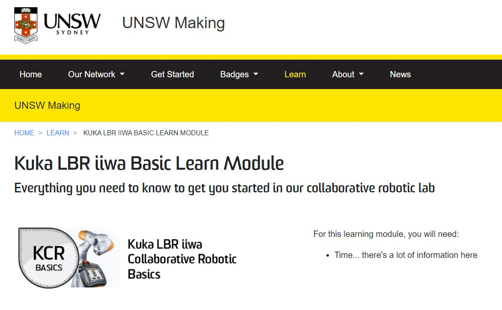
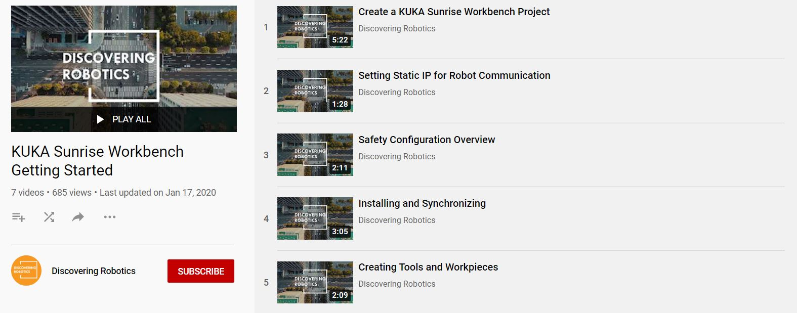
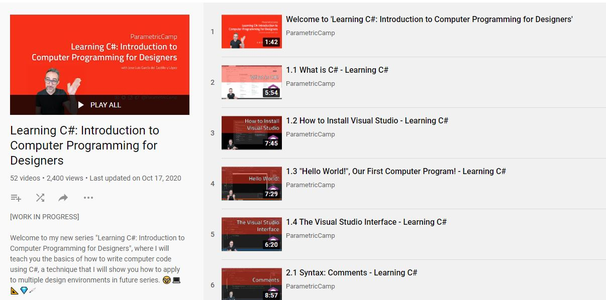

# Resource Dashboard
This repository is a collection of various useful links, resources, projects & code snippets relevant to my( our ) research at Department of Architecture, Design and Media Technology, Aalborg University.
The resources will be classified into following categories:
1. Robotics
2. AI and ML
3. Prototyping
4. Learning
5. Useful links

## 1. Robotics
### 1. KUKA IIWA Training

[UNSW Making](https://www.making.unsw.edu.au/learn/) has two great courses on Basic KUKA IIWA training with fundamental robot setup with KUKA PRC in Grasshopper.
* [Kuka LBR iiwa Basic Learn Module](https://www.making.unsw.edu.au/learn/kuka-lbr-iiwa-learn-module/)
* [Kuka LBR iiwa Programming Learn Module](https://www.making.unsw.edu.au/learn/kuka-lbr-iiwa-programming-learn-module/)

### 2. KUKA Sunrise programming

[Discovering Robotics](https://www.youtube.com/channel/UCUpAYPzgvBLT4q2r1JPZkcg/playlists) has two very useful playlist of 12 Videos of  getting started with KUKA Sunrise Programming and Sunrise Workbench.
* [KUKA Sunrise Workbench Getting Started](https://www.youtube.com/playlist?list=PLsZwlq7W-FY48xAJDllP8ag73LcWurlPQ)
* [KUKA Sunrise Programming](https://www.youtube.com/playlist?list=PLsZwlq7W-FY4iW3ZXMfBM4qdBdiGLEL9K)

## 2. AI and ML
## 3. Prototyping
## 4. Learning
### 1. C# Programming for Architects and Designers

[Jose Luis](https://github.com/garciadelcastillo) has created a fantastic course for learning C#. This course has been aimed at architects and designers. He also has taught, shared & uploaded full Harvard Course on Computational design. His channel Parametric Camp is an amazing place for learning computation design.  
* [C# For Architects and Designers](https://www.youtube.com/playlist?list=PLx3k0RGeXZ_yfAFk4GT3gWdFhwCsODUNb)
* [GSD-6338: Introduction to Computational Design (Fall 2019)](https://www.youtube.com/playlist?list=PLvxxYImPCApUXhX3te3IK32ileXHpzKY4)

## 5. Useful links
